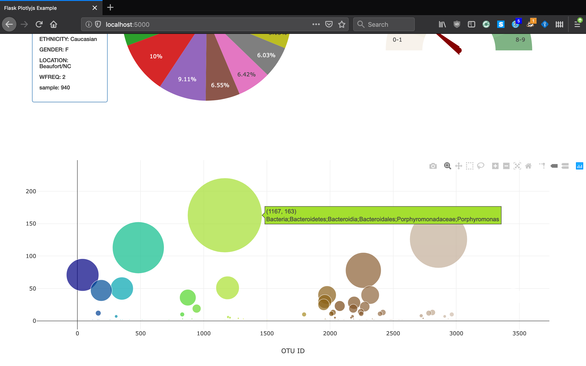

# Plot.ly Homework - Belly Button Biodiversity

In this assignment, you will build an interactive dashboard to explore the [Belly Button Biodiversity DataSet](http://robdunnlab.com/projects/belly-button-biodiversity/).

### Before You Begin

1. Create a new directory for this project called `plotly-challenge` or `week-15` or something similar . **Do not create a new repository**.

2. This is a full stack app so your add your html, js, css, python, and sqlite files.

3. Push the above changes to GitHub.

## Step 1 - Plotly.js

Use Plotly.js to build interactive charts for your dashboard.

* Create a PIE chart that uses data from your samples route (`/samples/<sample>`) to display the top 10 samples.

  * Use `sample_values` as the values for the PIE chart.

  * Use `otu_ids` as the labels for the pie chart.

  * Use `otu_labels` as the hovertext for the chart.

  

* Create a Bubble Chart that uses data from your samples route (`/samples/<sample>`) to display each sample.

  * Use `otu_ids` for the x values.

  * Use `sample_values` for the y values.

  * Use `sample_values` for the marker size.

  * Use `otu_ids` for the marker colors.

  * Use `otu_labels` for the text values.

  

* Display the sample metadata from the route `/metadata/<sample>`

  * Display each key/value pair from the metadata JSON object somewhere on the page.

* Update all of the plots any time that a new sample is selected.

* You are welcome to create any layout that you would like for your dashboard. An example dashboard page might look something like the following.

## Step 2 - Deploy

Deploy your Flask app!

* Ask your Instructor and TA for help!

- - -

## Advanced Challenge Assignment (Optional)

The following task is completely optional and is very advanced.

* Adapt the Gauge Chart from <https://plot.ly/javascript/gauge-charts/> to plot the Weekly Washing Frequency obtained from the `/metadata/<sample>`route.

* You will need to modify the example gauge code to account for values ranging from 0 - 9.

* Update the chart whenever a new sample is selected.

- - -

## Flask API

Use Flask API starter code to serve the data needed for your plots.

* Test your routes by visiting each one in the browser.

- - -

## Hints

* Don't forget to work in a virtual environment - it will help you keep track of all of your dependencies.

* Use `console.log` inside of your JavaScript code to see what your data looks like at each step.

* Refer to the [Plotly.js Documentation](https://plot.ly/javascript/) when building the plots.

- - -

### Copyright

Trilogy Education Services © 2019. All Rights Reserved.
